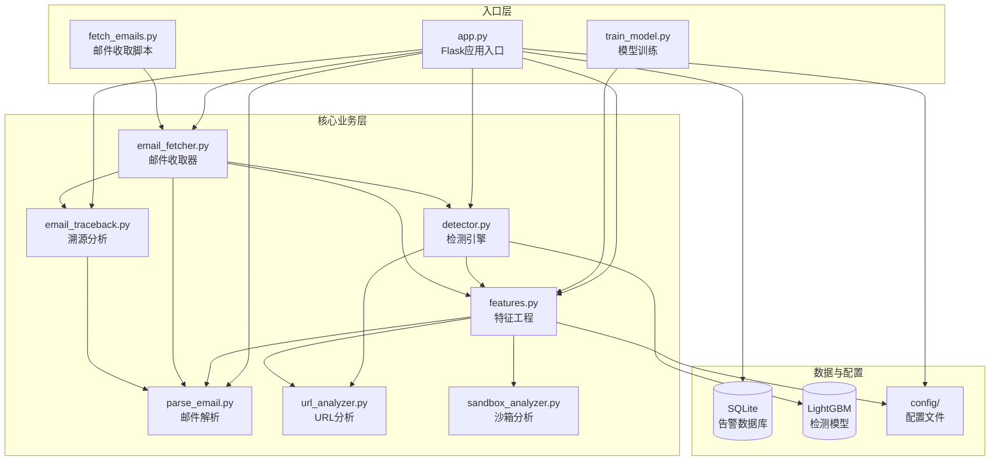
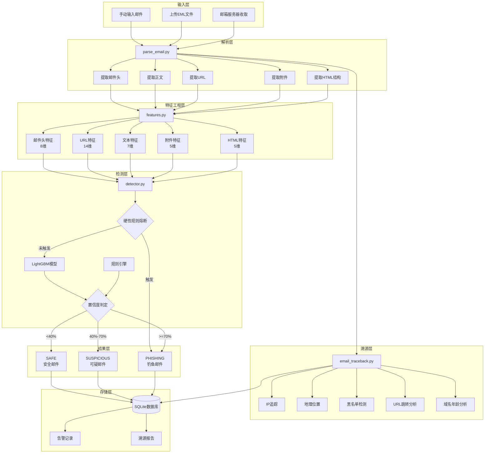
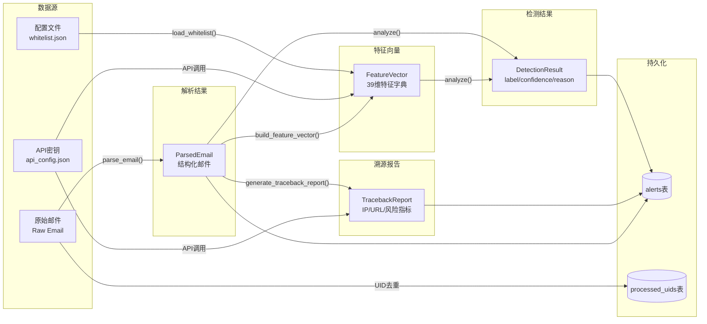
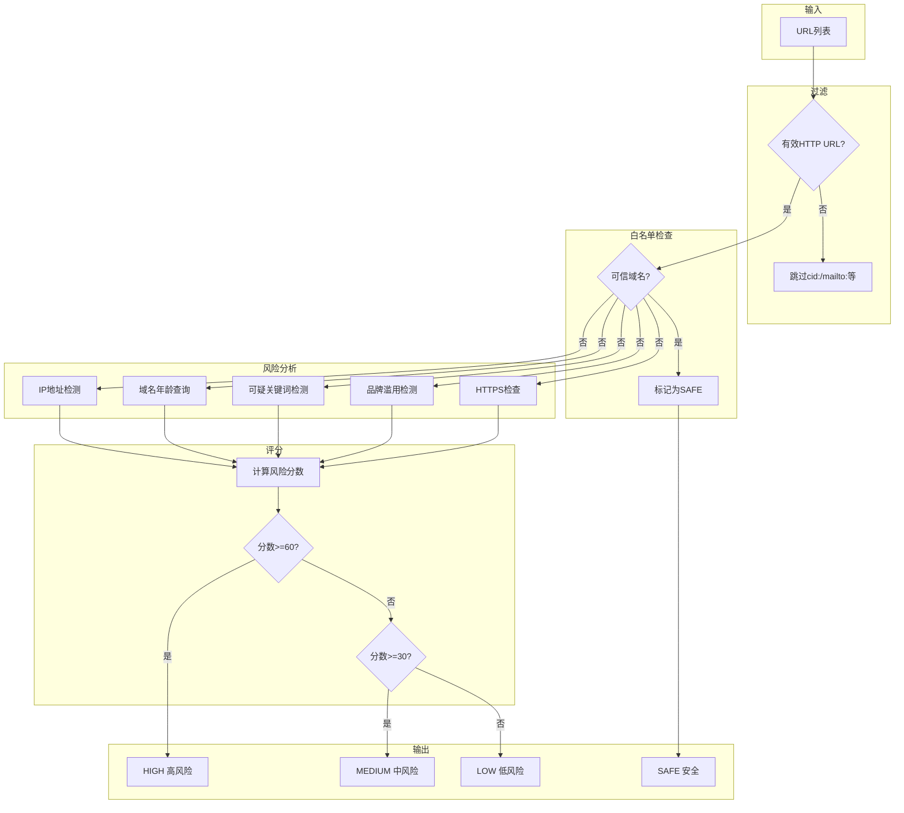
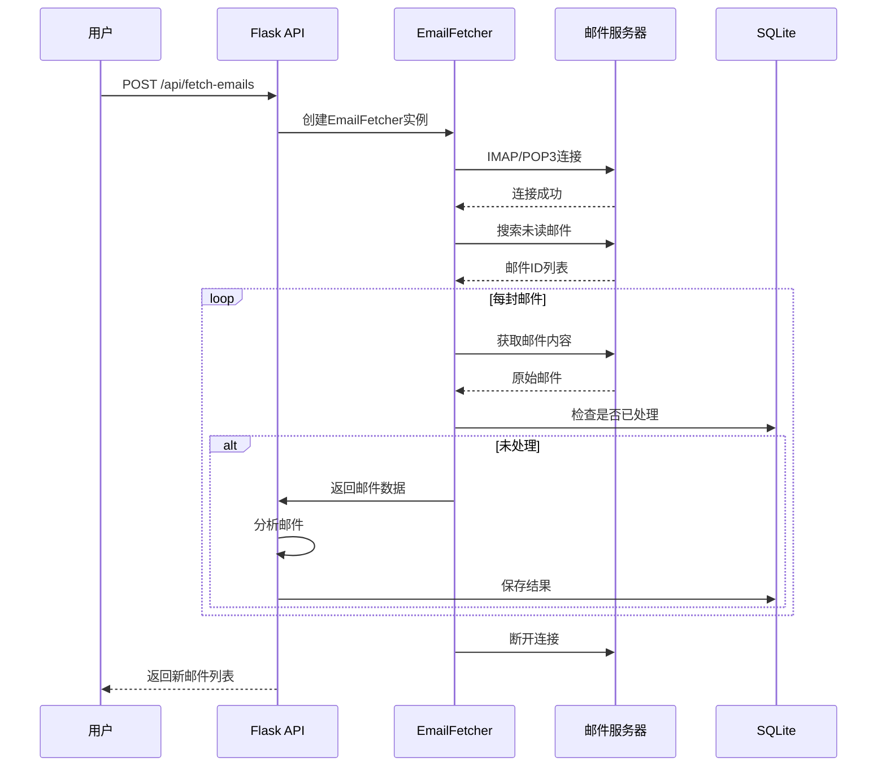

我将对项目进行全面的分析和优化规划。首先创建任务列表并开始深入分析项目。
        
            
toolName: todo_write
            
status: success
          
Todos updated: 5 items
          


​            
toolName: view_folder
​            
status: success
​          
c:\Users\k\Desktop\毕设\面向中小型企业的轻量化钓鱼邮件检测与溯源系统设计与实现 - 推送仓库
​          


​            
toolName: file_search
​            
status: success
​          
file_pattern: **/*.py
​          


​            
toolName: view_files
​            
status: success
​          
​            
filePath: c:\Users\k\Desktop\毕设\面向中小型企业的轻量化钓鱼邮件检测与溯源系统设计与实现 - 推送仓库\src\app.py
​          


​            
toolName: view_files
​            
status: success
​          
​            
filePath: c:\Users\k\Desktop\毕设\面向中小型企业的轻量化钓鱼邮件检测与溯源系统设计与实现 - 推送仓库\src\detector.py
​          


​            
toolName: view_files
​            
status: success
​          
​            
filePath: c:\Users\k\Desktop\毕设\面向中小型企业的轻量化钓鱼邮件检测与溯源系统设计与实现 - 推送仓库\src\features.py
​          


​            
toolName: view_files
​            
status: success
​          
​            
filePath: c:\Users\k\Desktop\毕设\面向中小型企业的轻量化钓鱼邮件检测与溯源系统设计与实现 - 推送仓库\src\parse_email.py
​          


​            
toolName: view_files
​            
status: success
​          
​            
filePath: c:\Users\k\Desktop\毕设\面向中小型企业的轻量化钓鱼邮件检测与溯源系统设计与实现 - 推送仓库\src\email_fetcher.py
​          


​            
toolName: view_files
​            
status: success
​          
​            
filePath: c:\Users\k\Desktop\毕设\面向中小型企业的轻量化钓鱼邮件检测与溯源系统设计与实现 - 推送仓库\src\email_traceback.py
​          


​            
toolName: view_files
​            
status: success
​          
​            
filePath: c:\Users\k\Desktop\毕设\面向中小型企业的轻量化钓鱼邮件检测与溯源系统设计与实现 - 推送仓库\src\url_analyzer.py
​          


​            
toolName: view_files
​            
status: success
​          
​            
filePath: c:\Users\k\Desktop\毕设\面向中小型企业的轻量化钓鱼邮件检测与溯源系统设计与实现 - 推送仓库\src\sandbox_analyzer.py
​          


​            
toolName: view_files
​            
status: success
​          
​            
filePath: c:\Users\k\Desktop\毕设\面向中小型企业的轻量化钓鱼邮件检测与溯源系统设计与实现 - 推送仓库\train_model.py
​          


​            
toolName: view_files
​            
status: success
​          
​            
filePath: c:\Users\k\Desktop\毕设\面向中小型企业的轻量化钓鱼邮件检测与溯源系统设计与实现 - 推送仓库\fetch_emails.py
​          


​            
toolName: view_files
​            
status: success
​          
​            
filePath: c:\Users\k\Desktop\毕设\面向中小型企业的轻量化钓鱼邮件检测与溯源系统设计与实现 - 推送仓库\requirements.txt
​          


​            
toolName: todo_write
​            
status: success
​          
Todos updated: 5 items
​          
基于对项目所有核心代码文件的深入分析，我现在为您提供完整的项目架构分析和优化规划报告。

---

# 📊 项目架构蓝图

## 一、技术栈概览

| 层级         | 技术选型           | 用途                |
| ------------ | ------------------ | ------------------- |
| **Web框架**  | Flask 2.3+         | RESTful API 服务    |
| **机器学习** | LightGBM 4.0+      | 钓鱼邮件分类模型    |
| **数据处理** | Pandas, NumPy      | 特征工程与数据处理  |
| **邮件解析** | Python email 模块  | MIME 邮件解析       |
| **外部API**  | VirusTotal, IP-API | URL检测与IP地理定位 |
| **数据库**   | SQLite             | 告警数据存储        |
| **域名查询** | python-whois       | 域名年龄分析        |

## 二、核心模块划分

```
┌─────────────────────────────────────────────────────────────────┐
│                        钓鱼邮件检测与溯源系统                        │
├─────────────────────────────────────────────────────────────────┤
│  ┌─────────────┐  ┌─────────────┐  ┌─────────────┐              │
│  │   入口层    │  │   API层     │  │   展示层    │              │
│  │ app.py     │  │ REST API   │  │ templates  │              │
│  └──────┬──────┘  └──────┬──────┘  └─────────────┘              │
│         │                │                                       │
│  ┌──────▼────────────────▼──────┐                               │
│  │         核心业务层            │                               │
│  ├──────────────────────────────┤                               │
│  │ detector.py      - 检测引擎  │                               │
│  │ features.py      - 特征工程  │                               │
│  │ parse_email.py   - 邮件解析  │                               │
│  │ url_analyzer.py  - URL分析   │                               │
│  │ email_traceback.py - 溯源分析│                               │
│  │ sandbox_analyzer.py - 沙箱   │                               │
│  │ email_fetcher.py - 邮件收取  │                               │
│  └──────────────────────────────┘                               │
│         │                                                        │
│  ┌──────▼──────┐  ┌─────────────┐  ┌─────────────┐              │
│  │   数据层    │  │   配置层    │  │   工具层    │              │
│  │ SQLite     │  │ whitelist   │  │ whois/req   │              │
│  │ models/    │  │ api_config  │  │ LightGBM    │              │
│  └─────────────┘  └─────────────┘  └─────────────┘              │
└─────────────────────────────────────────────────────────────────┘
```

## 三、模块依赖关系图



---


toolName: todo_write
            
status: success
          
Todos updated: 5 items
          
# 🔍 功能验证与解耦优化分析

## 一、现有功能模块完整性验证

| 模块         | 功能                           | 状态   | 完整性 |
| ------------ | ------------------------------ | ------ | ------ |
| **邮件解析** | MIME解析、附件提取、URL提取    | ✅ 完整 | 高     |
| **特征工程** | 39维特征提取、多维度分析       | ✅ 完整 | 高     |
| **检测引擎** | 三分类检测、规则熔断、模型预测 | ✅ 完整 | 高     |
| **URL分析**  | 风险评分、白名单、域名检测     | ✅ 完整 | 高     |
| **溯源分析** | IP追踪、地理位置、黑名单检测   | ✅ 完整 | 高     |
| **沙箱分析** | VirusTotal集成、文件哈希查询   | ✅ 完整 | 中     |
| **邮件收取** | IMAP/POP3协议支持              | ✅ 完整 | 高     |
| **Web API**  | RESTful接口、前端交互          | ✅ 完整 | 高     |

## 二、高耦合问题识别

### 🔴 问题1：配置硬编码与重复定义

**问题描述**：可信域名白名单在多个文件中重复定义

```python
# url_analyzer.py (第19-26行)
TRUSTED_DOMAINS = {
    'qq.com', 'qlogo.cn', 'mail.qq.com', ...
}

# email_traceback.py (第171-176行)
TRUSTED_DOMAINS = {
    'qq.com', 'qlogo.cn', 'mail.qq.com', ...
}

# features.py (通过函数动态加载)
def get_trusted_domains() -> Set[str]:
    config = load_whitelist_config()
    return set(config.get("trusted_domains", []))
```

**影响**：修改白名单需要同时修改多个文件，容易遗漏导致不一致

---

### 🔴 问题2：API密钥管理分散

**问题描述**：API密钥在多个位置被读取和传递

```python
# app.py
vt_api_key = api_config.get('virustotal', {}).get('api_key', '') or os.environ.get('VT_API_KEY', '')

# detector.py
def __init__(self, model_path: Optional[str] = None, vt_api_key: Optional[str] = None):
    self.vt_api_key = vt_api_key

# features.py
def build_feature_vector(parsed_email: Dict, vt_api_key: str = "", vt_api_url: str = "") -> Dict:

# email_traceback.py
def generate_traceback_report(parsed_email: Dict, vt_api_key: str = "", ip_api_url: str = "") -> Dict:
```

**影响**：密钥传递链路长，容易出错，难以统一管理

---

### 🔴 问题3：模块间循环依赖风险

**问题描述**：detector.py 动态导入 url_analyzer

```python
# detector.py (第17-22行)
try:
    from url_analyzer import analyze_urls, is_trusted_domain, check_domain_keywords
    URL_ANALYZER_AVAILABLE = True
except ImportError:
    URL_ANALYZER_AVAILABLE = False

# detector.py (第433-438行) - 运行时动态导入
if URL_ANALYZER_AVAILABLE:
    try:
        from url_analyzer import check_domain_keywords, get_registered_domain
```

**影响**：动态导入增加不确定性，难以进行静态分析

---

### 🔴 问题4：数据库操作与业务逻辑耦合

**问题描述**：app.py 中直接包含大量数据库操作代码

```python
# app.py (第121-187行) - 数据库初始化
def init_db():
    conn = sqlite3.connect(DATABASE_PATH)
    # ... 大量SQL语句

# app.py (第889-946行) - 数据保存
def save_to_database(parsed: Dict, label: str, confidence: float, ...):
    # ... 直接操作数据库
```

**影响**：数据库操作分散，难以维护和测试

---

### 🔴 问题5：特征列定义重复

**问题描述**：FEATURE_COLUMNS 在两个文件中重复定义

```python
# detector.py (第26-54行)
FEATURE_COLUMNS = [
    'is_suspicious_from_domain', 'received_hops_count', ...
]

# train_model.py (第15-43行)
FEATURE_COLUMNS = [
    'is_suspicious_from_domain', 'received_hops_count', ...
]

# features.py (第743-771行) - vector_to_list函数中再次定义
FEATURE_COLUMNS = [
    'is_suspicious_from_domain', 'received_hops_count', ...
]
```

**影响**：新增特征需要修改多处，容易遗漏

---

## 三、重构策略

### 📦 策略1：统一配置管理模块

**目标**：创建单一配置源，消除重复定义

```python
# 建议新增: src/core/config.py
class Config:
    """统一配置管理"""
    _instance = None
    
    def __new__(cls):
        if cls._instance is None:
            cls._instance = super().__new__(cls)
            cls._instance._load_config()
        return cls._instance
    
    def _load_config(self):
        # 加载所有配置
        self.whitelist = self._load_whitelist()
        self.api_keys = self._load_api_keys()
        self.feature_columns = self._define_features()
    
    @property
    def trusted_domains(self) -> Set[str]:
        return self.whitelist.get('trusted_domains', set())
```

**收益**：
- 消除3处重复定义
- 配置修改只需一处
- 支持热重载

---

### 📦 策略2：API密钥统一注入

**目标**：通过依赖注入模式管理API密钥

```python
# 建议新增: src/core/api_client.py
class APIClient:
    """统一API客户端"""
    def __init__(self, config: Config):
        self.config = config
        self._vt_session = None
        self._ip_api_session = None
    
    @property
    def vt_api_key(self) -> str:
        return self.config.api_keys.get('virustotal', '')
    
    def query_virustotal(self, url: str) -> float:
        # 统一的VT查询逻辑
        pass
```

**收益**：
- 密钥管理集中化
- 便于添加缓存、重试机制
- 支持多API密钥轮换

---

### 📦 策略3：数据访问层分离

**目标**：将数据库操作从业务逻辑中分离

```python
# 建议新增: src/data/repository.py
class AlertRepository:
    """告警数据仓库"""
    def __init__(self, db_path: str):
        self.db_path = db_path
    
    def save(self, alert: Alert) -> int:
        """保存告警"""
        pass
    
    def find_by_id(self, alert_id: int) -> Optional[Alert]:
        """查询告警"""
        pass
    
    def find_all(self, page: int, per_page: int, label: str = None) -> List[Alert]:
        """分页查询"""
        pass
```

**收益**：
- 业务逻辑与数据访问解耦
- 便于单元测试
- 支持切换数据库

---

### 📦 策略4：特征定义集中化

**目标**：单一特征定义源

```python
# 建议新增: src/features/feature_definition.py
class FeatureDefinition:
    """特征定义"""
    
    HEADER_FEATURES = [
        ('is_suspicious_from_domain', '可疑发件人域名'),
        ('received_hops_count', '邮件跳数'),
        # ...
    ]
    
    URL_FEATURES = [
        ('avg_domain_age_days', '平均域名年龄'),
        # ...
    ]
    
    @classmethod
    def all_columns(cls) -> List[str]:
        return [f[0] for f in cls.HEADER_FEATURES + cls.URL_FEATURES + ...]
```

**收益**：
- 特征定义唯一
- 便于文档生成
- 支持特征版本管理

---

### 📦 策略5：模块依赖重构

**目标**：消除循环依赖，建立清晰的依赖方向

```
重构后的依赖关系:

┌─────────────────────────────────────────────────┐
│                   app.py (入口)                  │
└─────────────────────┬───────────────────────────┘
                      │
        ┌─────────────┼─────────────┐
        ▼             ▼             ▼
┌───────────┐  ┌───────────┐  ┌───────────┐
│ detector  │  │ fetcher   │  │ traceback │
└─────┬─────┘  └─────┬─────┘  └─────┬─────┘
      │              │              │
      └──────────────┼──────────────┘
                     ▼
              ┌───────────┐
              │ features  │
              └─────┬─────┘
                    │
        ┌───────────┼───────────┐
        ▼           ▼           ▼
   ┌─────────┐ ┌─────────┐ ┌─────────┐
   │ parse   │ │url_anlzr│ │ sandbox │
   └─────────┘ └─────────┘ └─────────┘
        │           │           │
        └───────────┼───────────┘
                    ▼
              ┌───────────┐
              │  config   │ (核心配置)
              └───────────┘
```

---


toolName: todo_write
            
status: success
          
Todos updated: 5 items
          
# 📈 业务流程可视化

## 一、核心业务流程图



## 二、核心数据流向图



## 三、URL分析子流程



## 四、邮件收取流程



---


toolName: todo_write
            
status: success
          
Todos updated: 5 items
          
# 📁 目录结构重构方案

## 一、当前目录结构诊断

### 现有结构

```
项目根目录/
├── config/                    # 配置文件
│   ├── api_config.json
│   └── whitelist.json
├── data/                      # 数据文件
│   ├── emails-enron.mbox
│   ├── emails-phishing.mbox
│   ├── features-enron.csv
│   └── features-phishing.csv
├── logs/                      # 日志文件
├── progress/                  # 进度文档
│   ├── docs/
│   └── updates/
├── src/                       # 源代码
│   ├── templates/
│   ├── __init__.py
│   ├── app.py
│   ├── detector.py
│   ├── email_fetcher.py
│   ├── email_traceback.py
│   ├── features.py
│   ├── parse_email.py
│   ├── sandbox_analyzer.py
│   └── url_analyzer.py
├── static/                    # 静态文件
├── .env.example
├── Dockerfile
├── docker-compose.yml
├── fetch_emails.py            # ⚠️ 根目录脚本
├── requirements.txt
├── start.bat
├── start.sh
├── train_model.py             # ⚠️ 根目录脚本
└── test*.json                 # ⚠️ 测试文件散落
```

### 问题诊断

| 问题             | 描述                                         | 影响                 |
| ---------------- | -------------------------------------------- | -------------------- |
| **脚本散落**     | `fetch_emails.py`、`train_model.py` 在根目录 | 结构混乱，不符合规范 |
| **测试文件散落** | `test*.json` 文件在根目录                    | 污染项目根目录       |
| **模块职责不清** | `src/` 下所有文件平铺                        | 难以理解模块关系     |
| **缺少测试目录** | 无专门的测试目录                             | 无法组织单元测试     |
| **文档位置不当** | `progress/` 目录在项目根目录                 | 应移至 docs/         |
| **缺少核心层**   | 无 core/ 或 common/ 目录                     | 配置、工具类无处安放 |

---

## 二、新目录结构设计

基于 **分层架构** + **领域驱动设计(DDD)** 思想，设计如下结构：

```
phishing-detection-system/
│
├── 📂 src/                          # 源代码根目录
│   │
│   ├── 📂 core/                     # 核心层 - 配置、常量、工具
│   │   ├── __init__.py
│   │   ├── config.py                # 统一配置管理
│   │   ├── constants.py             # 常量定义
│   │   ├── exceptions.py            # 自定义异常
│   │   └── utils.py                 # 通用工具函数
│   │
│   ├── 📂 domain/                   # 领域层 - 业务实体
│   │   ├── __init__.py
│   │   ├── email.py                 # 邮件实体
│   │   ├── alert.py                 # 告警实体
│   │   └── feature_vector.py        # 特征向量实体
│   │
│   ├── 📂 parsing/                  # 解析层 - 邮件解析
│   │   ├── __init__.py
│   │   ├── email_parser.py          # 邮件解析器
│   │   ├── attachment_parser.py     # 附件解析器
│   │   └── html_parser.py           # HTML解析器
│   │
│   ├── 📂 features/                 # 特征层 - 特征工程
│   │   ├── __init__.py
│   │   ├── feature_definition.py    # 特征定义
│   │   ├── header_features.py       # 邮件头特征
│   │   ├── url_features.py          # URL特征
│   │   ├── text_features.py         # 文本特征
│   │   ├── attachment_features.py   # 附件特征
│   │   └── feature_builder.py       # 特征构建器
│   │
│   ├── 📂 detection/                # 检测层 - 检测引擎
│   │   ├── __init__.py
│   │   ├── detector.py              # 主检测器
│   │   ├── rules_engine.py          # 规则引擎
│   │   ├── model_predictor.py       # 模型预测器
│   │   └── url_analyzer.py          # URL分析器
│   │
│   ├── 📂 traceback/                # 溯源层 - 溯源分析
│   │   ├── __init__.py
│   │   ├── ip_tracer.py             # IP追踪
│   │   ├── url_tracer.py            # URL追踪
│   │   ├── geo_locator.py           # 地理定位
│   │   └── report_generator.py      # 报告生成
│   │
│   ├── 📂 sandbox/                  # 沙箱层 - 沙箱分析
│   │   ├── __init__.py
│   │   ├── virustotal_client.py     # VT客户端
│   │   └── file_analyzer.py         # 文件分析器
│   │
│   ├── 📂 fetcher/                  # 收取层 - 邮件收取
│   │   ├── __init__.py
│   │   ├── imap_fetcher.py          # IMAP收取器
│   │   └── pop3_fetcher.py          # POP3收取器
│   │
│   ├── 📂 data/                     # 数据层 - 数据访问
│   │   ├── __init__.py
│   │   ├── database.py              # 数据库连接
│   │   ├── alert_repository.py      # 告警仓库
│   │   └── models/                  # ML模型存储
│   │       └── phish_detector.txt
│   │
│   ├── 📂 api/                      # API层 - Web接口
│   │   ├── __init__.py
│   │   ├── app.py                   # Flask应用
│   │   ├── routes/                  # 路由模块
│   │   │   ├── __init__.py
│   │   │   ├── analyze.py           # 分析接口
│   │   │   ├── alerts.py            # 告警接口
│   │   │   ├── config.py            # 配置接口
│   │   │   └── fetch.py             # 收取接口
│   │   └── schemas/                 # 请求/响应模式
│   │       ├── __init__.py
│   │       └── alert_schema.py
│   │
│   └── 📂 cli/                      # CLI层 - 命令行工具
│       ├── __init__.py
│       ├── train.py                 # 模型训练脚本
│       └── fetch.py                 # 邮件收取脚本
│
├── 📂 config/                       # 配置文件
│   ├── api_config.json
│   ├── whitelist.json
│   └── logging.yaml                 # 日志配置
│
├── 📂 data/                         # 数据文件
│   ├── raw/                         # 原始数据
│   │   ├── emails-enron.mbox
│   │   └── emails-phishing.mbox
│   ├── processed/                   # 处理后数据
│   │   ├── features-enron.csv
│   │   └── features-phishing.csv
│   └── database/                    # 数据库文件
│       └── alerts.db
│
├── 📂 tests/                        # 测试目录
│   ├── __init__.py
│   ├── conftest.py                  # pytest配置
│   ├── unit/                        # 单元测试
│   │   ├── test_parser.py
│   │   ├── test_features.py
│   │   └── test_detector.py
│   ├── integration/                 # 集成测试
│   │   └── test_api.py
│   └── fixtures/                    # 测试数据
│       ├── test_emails/
│       └── test_configs/
│
├── 📂 docs/                         # 文档目录
│   ├── api/                         # API文档
│   ├── architecture/                # 架构文档
│   └── progress/                    # 进度记录
│       ├── docs/
│       └── updates/
│
├── 📂 logs/                         # 日志文件
│
├── 📂 static/                       # 静态文件
│   └── ...
│
├── 📂 templates/                    # 模板文件
│   ├── dashboard.html
│   └── report.html
│
├── .env.example                     # 环境变量示例
├── .gitignore
├── Dockerfile
├── docker-compose.yml
├── pyproject.toml                   # 项目配置
├── requirements.txt
├── requirements-dev.txt             # 开发依赖
├── start.bat
├── start.sh
└── README.md
```

---

## 三、文件迁移指南

### 迁移映射表

| 原位置                    | 新位置                              | 说明          |
| ------------------------- | ----------------------------------- | ------------- |
| `src/app.py`              | `src/api/app.py`                    | Flask应用入口 |
| `src/detector.py`         | `src/detection/detector.py`         | 检测引擎      |
| `src/features.py`         | `src/features/feature_builder.py`   | 特征构建      |
| `src/parse_email.py`      | `src/parsing/email_parser.py`       | 邮件解析      |
| `src/url_analyzer.py`     | `src/detection/url_analyzer.py`     | URL分析       |
| `src/email_traceback.py`  | `src/traceback/report_generator.py` | 溯源报告      |
| `src/sandbox_analyzer.py` | `src/sandbox/file_analyzer.py`      | 沙箱分析      |
| `src/email_fetcher.py`    | `src/fetcher/imap_fetcher.py`       | 邮件收取      |
| `train_model.py`          | `src/cli/train.py`                  | 训练脚本      |
| `fetch_emails.py`         | `src/cli/fetch.py`                  | 收取脚本      |
| `test*.json`              | `tests/fixtures/test_emails/`       | 测试数据      |
| `progress/`               | `docs/progress/`                    | 进度文档      |
| `src/templates/`          | `templates/`                        | 模板文件      |

### 迁移步骤

```bash
# 步骤1: 创建新目录结构
mkdir -p src/{core,domain,parsing,features,detection,traceback,sandbox,fetcher,data,api/routes,api/schemas,cli}
mkdir -p tests/{unit,integration,fixtures/test_emails}
mkdir -p docs/{api,architecture,progress}
mkdir -p data/{raw,processed,database}

# 步骤2: 迁移核心文件
mv src/features.py src/features/feature_builder.py
mv src/parse_email.py src/parsing/email_parser.py
mv src/detector.py src/detection/detector.py
mv src/url_analyzer.py src/detection/url_analyzer.py
mv src/email_traceback.py src/traceback/report_generator.py
mv src/sandbox_analyzer.py src/sandbox/file_analyzer.py
mv src/email_fetcher.py src/fetcher/imap_fetcher.py
mv src/app.py src/api/app.py

# 步骤3: 迁移脚本
mv train_model.py src/cli/train.py
mv fetch_emails.py src/cli/fetch.py

# 步骤4: 迁移测试数据
mv test*.json tests/fixtures/test_emails/

# 步骤5: 迁移文档
mv progress/* docs/progress/

# 步骤6: 迁移模板
mv src/templates/* templates/
```

---

## 四、新结构解决的问题

| 原问题         | 解决方案                    |
| -------------- | --------------------------- |
| 脚本散落根目录 | 统一移至 `src/cli/`         |
| 测试文件散落   | 移至 `tests/fixtures/`      |
| 模块职责不清   | 按领域划分子目录            |
| 缺少测试目录   | 新增 `tests/` 目录          |
| 文档位置不当   | 统一至 `docs/`              |
| 缺少核心层     | 新增 `src/core/`            |
| 配置重复定义   | 统一至 `src/core/config.py` |
| 数据文件混乱   | 按类型划分子目录            |

---


toolName: todo_write
            
status: success
          
Todos updated: 5 items
          
---

# 📋 项目分析总结报告

## 一、项目概况

| 项目名称 | 钓鱼邮件检测与溯源系统                   |
| -------- | ---------------------------------------- |
| 技术栈   | Flask + LightGBM + SQLite                |
| 核心功能 | 邮件解析、特征提取、三分类检测、溯源分析 |
| 代码规模 | ~3000行核心代码，11个Python模块          |
| 架构模式 | 分层架构（入口→业务→数据）               |

## 二、发现的主要问题

### 🔴 高优先级问题

1. **配置重复定义** - 可信域名白名单在3个文件中重复
2. **API密钥管理分散** - 密钥传递链路长，难以统一管理
3. **特征列定义重复** - FEATURE_COLUMNS在3处定义
4. **数据库操作耦合** - SQL语句直接嵌入业务逻辑

### 🟡 中优先级问题

5. **模块依赖不清晰** - 动态导入增加不确定性
6. **目录结构混乱** - 脚本、测试文件散落根目录
7. **缺少测试框架** - 无单元测试目录

## 三、重构建议优先级

| 优先级 | 重构项           | 预估工作量 | 收益                     |
| ------ | ---------------- | ---------- | ------------------------ |
| P0     | 统一配置管理模块 | 2天        | 消除重复，提高可维护性   |
| P0     | 特征定义集中化   | 1天        | 避免不一致，便于扩展     |
| P1     | 数据访问层分离   | 2天        | 解耦业务与数据，便于测试 |
| P1     | 目录结构重构     | 1天        | 提高可读性，符合规范     |
| P2     | API密钥统一注入  | 1天        | 安全性提升，便于管理     |
| P2     | 添加测试框架     | 2天        | 提高代码质量             |

## 四、架构优化路线图

```
Phase 1 (Week 1-2): 基础重构
├── 创建 src/core/config.py 统一配置
├── 创建 src/features/feature_definition.py 集中特征定义
└── 消除重复代码

Phase 2 (Week 3-4): 结构优化
├── 重构目录结构
├── 创建数据访问层
└── 分离API路由

Phase 3 (Week 5-6): 质量提升
├── 添加单元测试
├── 添加集成测试
└── 完善文档
```

---

以上是对项目的全面分析和优化规划。如需进一步细化某个部分或开始实施重构，请告知。